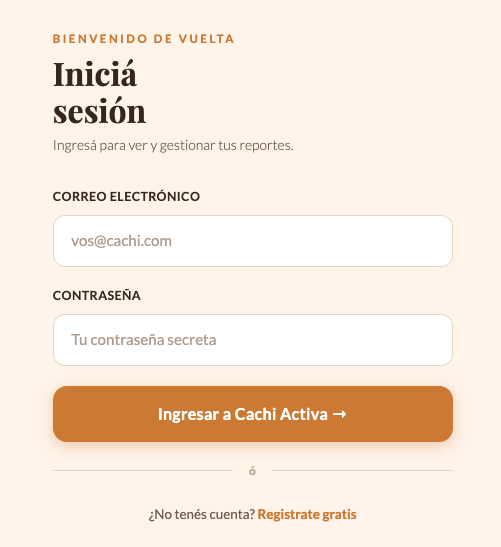
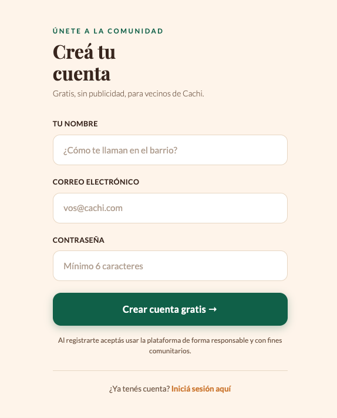
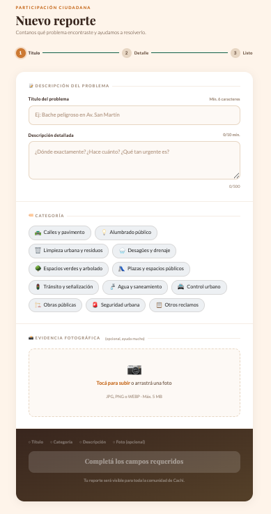
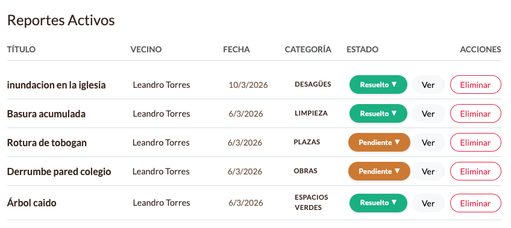
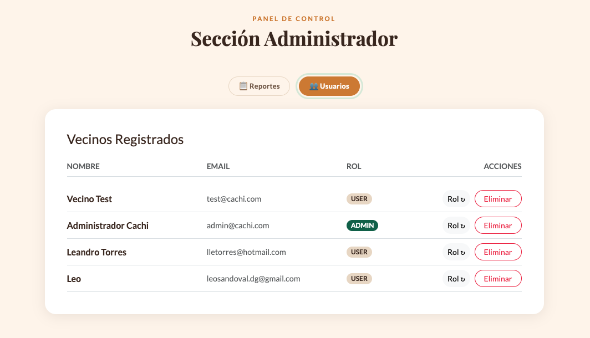

# 🏙️ Cachi Activa — Sistema de Reclamos Municipales

<div align="center">


[](https://cachi-reclamos-front.vercel.app/)
[](https://github.com/lletorres/cachi_reclamos_back)
[](https://github.com/lletorres/cachi_reclamos_front)


</div>

---

## 🧩 ¿Qué es Cachi Activa?

**Cachi Activa** es una aplicación web para la gestión de reclamos municipales. Surge de una necesidad concreta: los vecinos de pequeños municipios muchas veces no tienen una forma clara y digital de reportar problemas en la vía pública — baches, luminarias rotas, basura acumulada, filtraciones en desagües, entre otros.

Con esta plataforma, cualquier vecino puede registrarse, iniciar sesión y cargar un reclamo con título, descripción, categoría e incluso una foto del problema. El equipo administrativo recibe una notificación por email y puede gestionar el estado de cada caso desde un panel de control.

> Este proyecto es parte de mi portfolio personal. Fue desarrollado para practicar arquitectura REST, autenticación con JWT e integración con servicios externos como Cloudinary y Resend.

---

## 🚀 Funcionalidades principales

### 👤 Para vecinos

- Registro e inicio de sesión con autenticación segura (JWT)
- Creación de reclamos con título, descripción y categoría
- Adjuntar imagen como evidencia del problema (se sube a Cloudinary)
- Recibir email de confirmación al enviar un reclamo
- Ver el listado de reclamos registrados

### 🛠️ Para administradores

- Panel de administración con vista de todos los reclamos
- Cambiar el estado de un reclamo: `Pendiente` → `En Proceso` → `Resuelto`
- Gestión de usuarios: ver, cambiar rol y eliminar cuentas
- Recibir notificación por email cuando se crea un nuevo reclamo

### ⚙️ Técnico

- API REST con Express.js y Node.js
- Persistencia de datos con MongoDB Atlas
- Almacenamiento de imágenes en Cloudinary (conversión automática a WebP)
- Envío de emails transaccionales con Resend
- Protección de rutas con middleware JWT

---

## 🛠️ Tecnologías utilizadas

### Backend

| Tecnología          | Uso                                 |
| ------------------- | ----------------------------------- |
| Node.js + Express 5 | Servidor y API REST                 |
| MongoDB + Mongoose  | Base de datos NoSQL                 |
| JWT (jsonwebtoken)  | Autenticación y autorización        |
| bcryptjs            | Hasheo de contraseñas               |
| Cloudinary + Multer | Upload y transformación de imágenes |
| Resend              | Envío de emails transaccionales     |
| dotenv              | Variables de entorno                |
| nodemon             | Desarrollo con recarga automática   |

### Frontend

| Tecnología      | Uso                         |
| --------------- | --------------------------- |
| React           | Interfaz de usuario         |
| React Router    | Navegación entre vistas     |
| Axios / Fetch   | Comunicación con la API     |
| Bootstrap / CSS | Estilos y layout responsivo |

---

## 📸 Capturas de pantalla

> **Nota:** Sección con imágenes del proyecto en funcionamiento.

| Vista                                                   | Descripción                          |
| ------------------------------------------------------- | ------------------------------------ |
|                    | Pantalla de inicio de sesión         |
|              | Formulario de registro               |
|  | Creación de nuevo reclamo con imagen |
|       | Listado de reclamos con estados      |
|              | Panel de administración              |

---

## ⚙️ Instalación y ejecución local

### Requisitos previos

- Node.js >= 20
- Cuenta en MongoDB Atlas (o MongoDB local)
- Cuenta en Cloudinary (gratuita)
- Cuenta en Resend (gratuita)

---

### 1. Clonar los repositorios

```bash
# Backend
git clone https://github.com/lletorres/cachi_reclamos_back.git
cd cachi_reclamos_back

# Frontend (en otra terminal)
git clone https://github.com/lletorres/cachi_reclamos_front.git
cd cachi_reclamos_front
```

### 2. Instalar dependencias

```bash
# Backend
cd cachi_reclamos_back
npm install

# Frontend
cd cachi_reclamos_front
npm install
```

### 3. Configurar variables de entorno

En la carpeta del **backend**, crear un archivo `.env` basado en `.env.example`:

```env
# Servidor
PORT=4000

# Base de datos
MONGODB_URI=mongodb+srv://<usuario>:<password>@cluster.mongodb.net/cachi_activa

# JWT
SECRET=tu_clave_secreta_aqui

# Cloudinary
CLOUDINARY_CLOUD_NAME=tu_cloud_name
CLOUDINARY_API_KEY=tu_api_key
CLOUDINARY_API_SECRET=tu_api_secret

# Email (Resend)
RESEND_API_KEY=re_xxxxxxxxxxxxxxxx
EMAIL_FROM=noreply@tudominio.com
ADMIN_EMAIL=admin@tudominio.com
```

En la carpeta del **frontend**, crear un archivo `.env`:

```env
VITE_API_URL=http://localhost:4000/api
```

### 4. Crear usuario administrador

```bash
# Desde la carpeta del backend
node seedAdmin.js
```

Esto crea el usuario `admin@cachi.com` con contraseña `admin123`. **Cambiar en producción.**

### 5. Ejecutar el proyecto

```bash
# Backend (modo desarrollo)
cd cachi_reclamos_back
npm run dev
# Servidor en http://localhost:4000

# Frontend (en otra terminal)
cd cachi_reclamos_front
npm run dev
# App en http://localhost:5173
```

---

## 🔐 Autenticación con JWT

El sistema usa **JSON Web Tokens (JWT)** para proteger las rutas que requieren un usuario autenticado.

**Flujo:**

1. El usuario se registra o inicia sesión → el servidor genera un token firmado con una clave secreta
2. El frontend almacena el token (localStorage o estado global)
3. En cada request a una ruta protegida, el token se envía en el header:
   ```
   Authorization: Bearer <token>
   ```
4. El middleware `verifyToken` valida el token antes de ejecutar el controlador

**El token incluye:** `id` del usuario y su `rol` (`user` o `admin`).
**Expiración:** 24 horas.

> ⚠️ **Nota de seguridad conocida:** Las rutas administrativas (cambio de rol, eliminación de usuarios) actualmente solo verifican que el token sea válido, pero no que el usuario tenga rol `admin`. Esto está documentado como mejora pendiente (ver sección de mejoras).

---

## 📡 API Endpoints

Base URL: `https://[tu-backend].railway.app/api`

### Usuarios

| Método   | Endpoint          | Descripción               | Auth requerida |
| -------- | ----------------- | ------------------------- | -------------- |
| `POST`   | `/users/register` | Registrar nuevo usuario   | ❌             |
| `POST`   | `/users/login`    | Iniciar sesión            | ❌             |
| `GET`    | `/users/`         | Listar todos los usuarios | ✅ Token       |
| `PATCH`  | `/users/:id/rol`  | Cambiar rol de usuario    | ✅ Token       |
| `DELETE` | `/users/:id`      | Eliminar usuario          | ✅ Token       |

### Reclamos

| Método   | Endpoint        | Descripción                      | Auth requerida |
| -------- | --------------- | -------------------------------- | -------------- |
| `POST`   | `/reportes/`    | Crear nuevo reclamo (con imagen) | ✅ Token       |
| `GET`    | `/reportes/`    | Obtener todos los reclamos       | ❌             |
| `PATCH`  | `/reportes/:id` | Actualizar estado del reclamo    | ✅ Token       |
| `DELETE` | `/reportes/:id` | Eliminar reclamo                 | ✅ Token       |

**Ejemplo de body para crear reclamo** (multipart/form-data):

```
titulo: "Bache en Av. San Martín"
descripcion: "Bache de gran tamaño frente al número 452"
categoria: "Calles"
imagen: [archivo de imagen]
```

**Categorías disponibles:**
`Calles` · `Alumbrado` · `Limpieza` · `Desagües` · `Espacios Verdes` · `Plazas` · `Tránsito` · `Agua` · `Control` · `Obras` · `Seguridad` · `Otros`

---

## 🛡️ Seguridad

### Implementado

- ✅ Contraseñas hasheadas con **bcryptjs** (salt rounds: 10)
- ✅ Autenticación por **JWT** con expiración de 24h
- ✅ El campo `password` nunca se retorna en las respuestas (eliminado en `toJSON`)
- ✅ CORS configurado solo para orígenes permitidos
- ✅ Variables sensibles en `.env` (nunca commiteadas)
- ✅ Imágenes procesadas y transformadas en Cloudinary (no se guardan localmente)

### Pendiente de implementar (mejoras conocidas)

- ⚠️ Verificación de rol `admin` en rutas administrativas (RBAC completo)
- ⚠️ Rate limiting en endpoints de login y registro
- ⚠️ Sanitización de inputs con `express-validator`
- ⚠️ Headers de seguridad con `helmet`

---

## 🧪 Testing

Se realizó **testing manual** del sistema, documentado con criterios de calidad profesionales:

| Métrica               | Resultado               |
| --------------------- | ----------------------- |
| Test Cases ejecutados | 18                      |
| ✅ PASS               | 13 (72.2%)              |
| ❌ FAIL               | 5 (27.8%)               |
| Bugs reportados       | 6                       |
| Bugs críticos         | 1 (verificación de rol) |

**Tipos de testing realizados:**

- Testing funcional (flujos principales)
- Testing negativo (datos inválidos, campos vacíos)
- Testing de seguridad básico (auth, JWT expirado, acceso sin token)
- Testing de API con Postman (16 casos)

📄 La documentación completa de QA está disponible en la carpeta [`/qa`](./qa/) del repositorio e incluye:

- Test Plan con alcance y criterios
- Test Cases detallados con pasos y resultados esperados
- Test Execution Report
- Bug Reports con severidad y pasos para reproducir

---

## 📊 Aprendizajes

Algunos de los conceptos que practiqué y consolidé con este proyecto:

**Backend y arquitectura:**

- Separación en capas (routes → controllers → services) para mantener el código limpio y testeable
- Implementación de autenticación stateless con JWT desde cero
- Integración con servicios externos (Cloudinary para imágenes, Resend para emails) usando variables de entorno

**Bases de datos:**

- Modelado de datos con Mongoose y relaciones entre colecciones (`populate`)
- Uso de `toJSON` para limpiar automáticamente datos sensibles en las respuestas

**Buenas prácticas:**

- La importancia de validar tanto en el frontend como en el backend (aprendido a partir de bugs encontrados en testing)
- Por qué el testing negativo y de seguridad es tan importante como el happy path
- Cómo documentar bugs de forma que sean reproducibles y accionables

---

## 🔧 Mejoras futuras

- [ ] **Verificación de rol en rutas admin** — agregar middleware `verifyAdmin` para proteger operaciones sensibles
- [ ] **Rate limiting** — prevenir fuerza bruta en login/registro con `express-rate-limit`
- [ ] **Paginación** — el listado de reclamos necesitará paginación cuando la BD crezca
- [ ] **Filtros y búsqueda** — filtrar por categoría, estado y rango de fechas
- [ ] **Notificación de cambio de estado** — email al vecino cuando el admin actualiza su reclamo
- [ ] **Testing automatizado** — tests unitarios con Jest para los servicios
- [ ] **CI/CD** — pipeline en GitHub Actions para correr tests en cada push
- [ ] **Número de reclamo amigable** — reemplazar el ObjectId por un código como `#0001`
- [ ] **Perfil de usuario editable** — cambio de nombre y contraseña desde la app

---

## 👨‍💻 Autor

**Lean Torres**

Desarrollador Full Stack en formación, con foco en proyectos con impacto real y buenas prácticas desde el primer día.

[](https://github.com/lletorres)
[](https://linkedin.com/in/lletorres)

---

## 📄 Licencia

Este proyecto fue desarrollado con fines educativos y de portfolio personal.
Podés usarlo como referencia o punto de partida para tus propios proyectos.

---

<div align="center">
<sub>Hecho con ☕ y muchos console.log() · Cachi Activa v1.0</sub>
</div>
